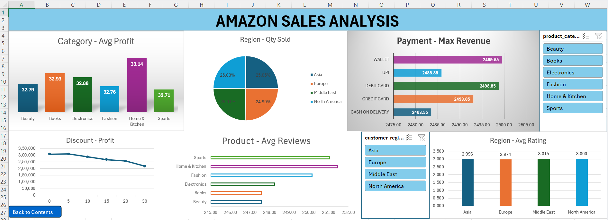
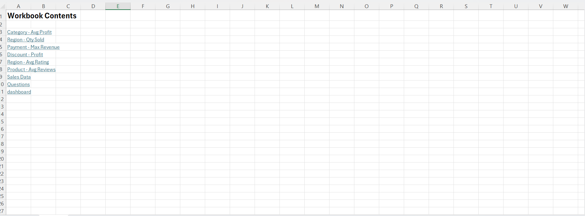

## 📊 Amazon Sales Analysis Dashboard

An interactive Excel dashboard analyzing 50,000+ Amazon sales transactions to uncover pricing, regional, and product performance insights.
---

## 📸 Screenshots

### 📊 Dashboard View

### 🔗 Contents Page

---

### 🔍 Dataset
- 50,000 orders across 6 product categories: Beauty, Books, Electronics, Fashion, Home & Kitchen, Sports
- 4 customer regions: Asia, Europe, Middle East, North America
- 5 payment methods: Credit Card, Debit Card, UPI, Wallet, Cash on Delivery
- 14 fields: order_id, order_date, product_id, category, price, discount %, quantity sold, region, payment method, rating, review count, discounted price, revenue, profit

---

## 🌟 Key Highlights
- Profit drops sharply with higher discounts — 30% discount yields ₹2.17L vs ₹3.09L at 5%
- Home & Kitchen achieves the highest average profit (₹33.14) across all categories
- Wallet payment method generates the highest max revenue (₹2,499.55)
- All regions hold nearly equal quantity share (~25%), showing balanced global distribution
✨ Auto-generates a **Contents Page**  
🔗 One-click navigation to all worksheets  
🔙 Smart **Back to Contents** button on every sheet  
⚡ Fully automated using VBA macros  
📌 Clean, user-friendly design

---

### 🛠 Features
- 6 interactive PivotCharts — bar, pie, line, horizontal bar
- Dynamic slicers to filter by product category and customer region
- Structured workbook with Contents sheet and navigation button
- Clean dashboard layout with consistent chart titling and formatting

---

## 🛠️ Built With
- 📊 Microsoft Excel  
- 💻 VBA (Visual Basic for Applications)  

---

## ⚙️ How It Works
1. Open the Excel file  
2. Enable macros  
3. Run the macro: `SmartContentsManager`  
4. Instantly navigate using the generated contents page  

---

## 💡 Why This Project?
Managing multiple sheets in Excel can be confusing.  
This project simplifies navigation and improves productivity with automation.

---

## 📁 Project File
Download the Excel file from this repository and explore the dashboard.

---

## 👩‍💻 Author
**Nikhitha Lade**

---

⭐ If you found this project useful, feel free to star the repository!
